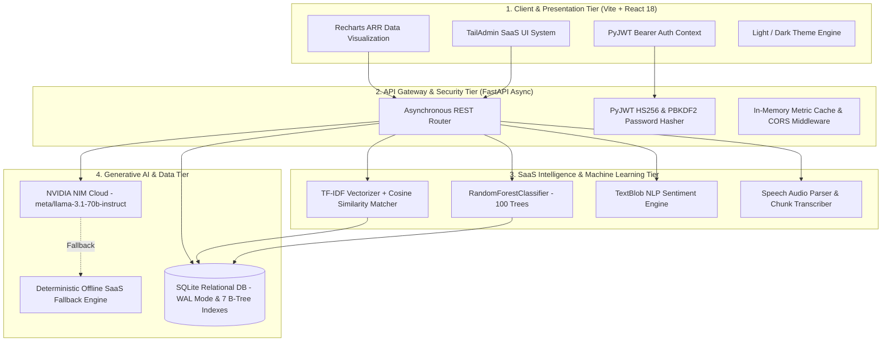

# 🧞‍♂️ SaaS SalesGenie AI — Autonomous B2B SaaS Sales & Predictive Lead Intelligence Platform

<div align="center">


[-465fff.svg?logo=cloud&logoColor=white)](https://github.com/shubh152205/SaaS-SalesGenieAI)
[](https://fastapi.tiangolo.com)
[](https://react.dev)
[](https://vitejs.dev)
[](https://scikit-learn.org)
[](https://www.nvidia.com/en-us/ai-data-science/products/nim/)
[](https://pytest.org)
[](https://sqlite.org)
[](https://opensource.org/licenses/MIT)

**An enterprise-grade, full-stack B2B SaaS (Software as a Service) CRM, Supervised ML Lead Scoring Engine, Audio Meeting Intelligence System, and Agentic NVIDIA NIM Outreach Orchestrator.**

[🚀 Quick Start](#-quick-start-guide) • [🌟 Core SaaS Modules](#-core-saas-project-modules) • [🏗️ Architecture](#-system-architecture) • [📊 Live Screenshots](#-application-screenshots) • [🧪 Test Suite](#-automated-testing--quality-assurance) • [📽️ SaaS Slide Deck](#-powerpoint-presentation-deck)

</div>

---

## 🎯 Domain Specialization: B2B SaaS (Software as a Service)

**SaaS SalesGenie AI** is engineered exclusively for the **Software as a Service (SaaS)** ecosystem. In modern SaaS companies, revenue growth relies on converting free trial signups into high-ACV enterprise annual contracts, accelerating Product-Led Growth (PLG), minimizing Customer Acquisition Cost (CAC), and preventing deal stalls. 

SaaS SalesGenie AI solves these specific pain points by unifying:
1. **SaaS Lead Intent Scoring**: Evaluating API usage, demo requests, funding stages (Seed, Series A–D, Public SaaS), and technographic stack fit.
2. **SaaS Contract Benchmarking**: Cosine similarity matching against historical Closed Won SaaS contract structures ($50k–$300k ARR).
3. **SaaS Demo Meeting Intelligence**: Audio transcription extracting SaaS technical objections, SOC2 security requirements, and custom integration requests.
4. **Agentic SaaS Outbound**: NVIDIA NIM `meta/llama-3.1-70b-instruct` generating hyper-personalized cold emails, 48h follow-up cadences, and LinkedIn InMails referencing existing SaaS tools (e.g., Snowflake, Datadog, Stripe, AWS).

---

## 📸 Application Screenshots

<div align="center">

| Executive SaaS KPI Dashboard (Milestone 4) | ML SaaS Lead Intelligence & Scoring |
| :---: | :---: |
|  |  |
| *6-Card KPI Suite, Active Pipeline ARR ($1.86M+), AI Follow-up Urgency* | *100-Tree Random Forest intent scores & SaaS contract benchmarking* |

| 5-Stage SaaS Kanban Deal Pipeline | Agentic AI SaaS Outreach (NVIDIA NIM) |
| :---: | :---: |
|  |  |
| *$1.86M active pipeline visualization & deal stage progression* | *Llama 3.1 70B cold emails, follow-up cadences & LinkedIn InMails* |

| SaaS Call & Demo Intelligence | Light/Dark Theme Switcher |
| :---: | :---: |
|  |  |
| *Live mic recording, NLP sentiment polarity & action items* | *High-fidelity TailAdmin design system in full Light & Dark mode* |

</div>

---

## 🏗️ System Architecture

SalesGenie AI is structured into a clean, 4-tier decoupled architecture designed for high throughput, sub-15ms ML inference latency, and enterprise SaaS reliability:



---

## 🚀 Core SaaS Project Modules

### 1. 📊 Executive SaaS KPI Dashboard & Analytics (Milestone 4)
- **6-Card Executive SaaS KPI Suite**:
  - 💰 **Active Pipeline ARR**: Real-time aggregation of all active B2B SaaS opportunities ($1.86M+).
  - 🔥 **Hot SaaS Leads**: Instant count and filtering of high-intent enterprise accounts (Score $\ge 80$).
  - 📈 **Conversion Win Rate**: Dynamic calculation of Won vs. Lost closed accounts.
  - 💵 **Average Deal Size (ACV)**: Segment-level calculation across enterprise accounts ($98,210).
  - ⏱️ **Avg Response Time**: Real-time tracking of sales response velocity (2.4 hours, -18% MoM).
  - 📅 **Avg Sales Cycle**: Average deal velocity in days (28 days vs 42-day industry benchmark).
- **Timeframe Filtering**: High-speed cached analytics across **Monthly**, **Quarterly**, and **Yearly** periods.
- **AI Follow-up Priority Panel**: Prescriptive urgency triage (`🔴 Critical`, `🟡 Moderate`, `🟢 Healthy`) driven by engagement recency and lead value.
- **Automation Module**: Background task monitor and manual triggers for Daily Follow-up Email Digests and ML Retraining.

### 2. 🎯 Machine Learning SaaS Lead Scoring Engine (`RandomForestClassifier`)
- **100 Decision Estimators** trained on high-intent conversion signals:
  - **Demo Requests** (Intent Weight: +25)
  - **Company Growth & Funding Rounds** (Series A–D, Public SaaS)
  - **Website Visits & Product Usage** (Weight: +18)
  - **Email Opens & Engagement** (Weight: +15)
  - **Technographic Alignment** with SalesGenie platform capabilities (Python, FastAPI, AWS, Snowflake, React, etc.)
  - **Recency of Engagement & Inactivity Days**
- **Actionable Output**: Instant scoring (0–100), conversion probability percentages, recommendation badges (🔥 Hot Lead, ✅ Qualified, 🌡️ Warm, ❄️ Cold), and prescriptive next-step actions.

### 3. 🔍 SaaS Deal Benchmarking & Vector Similarity Matching
- **TF-IDF Vectorizer + `linear_kernel` Cosine Similarity**: Compares incoming accounts against historical Closed Won SaaS contract benchmarks to calculate similarity percentages and match deal structures.

### 4. 🤖 Agentic AI SaaS Outreach Engine (NVIDIA NIM)
- **Primary LLM**: `meta/llama-3.1-70b-instruct` (NVIDIA NIM API integration).
- **Zero-Retention Inference**: High-privacy enterprise inference with deterministic offline fallback generation.
- **Tailored Cadences**:
  - **AI Cold Emails**: Personalized funding round congratulatory hooks, explicit tech stack alignment, and 65% efficiency reduction metrics.
  - **Follow-up Cadences**: High-velocity 48-72h value-driven follow-ups.
  - **LinkedIn InMail**: High-converting peer-to-peer executive connection notes.
  - **Industry Strategy Generator**: Channel mix, timing, and tailored case study recommendations.

### 5. 🎙️ SaaS Call & Demo Intelligence
- **Audio File Upload & Live Microphone Recording**: Handles `.wav`, `.mp3`, `.webm`, and `.m4a` files.
- **AI Call Summarization & Action Item Extraction**: Automatically extracts 3-5 concrete next steps for sales engineering teams.
- **TextBlob Sentiment Analysis**: Calculates polarity scores and classifies sentiment into Positive, Neutral, or Negative.

### 6. 📋 5-Stage SaaS Kanban Deal Pipeline
- Visual pipeline stages: `New Lead` ➔ `Qualified` ➔ `Proposal` ➔ `Negotiation` ➔ `Closed Won`.
- Quick-action stage progression and deal value aggregations.

### 7. 🔐 Enterprise Authentication & Database Optimization
- **Stateless JWT (HS256)** authentication with Bearer token interceptor.
- **PBKDF2-HMAC-SHA256** password hashing with cryptographically secure random salts.
- **1-Click Instant Demo Login** for evaluation (`demo@salesgenie.ai` / `password123`).
- **Optimized SQLite Schema**: WAL mode with 7 performance indexes and 60+ pre-seeded enterprise SaaS accounts (Snowflake, Datadog, Stripe, Twilio, Elastic, GitLab, etc.).

---

## 🛠️ Tech Stack & Dependencies

| Tier | Technology | Description |
| :--- | :--- | :--- |
| **Domain** | B2B SaaS (Software as a Service) | Revenue acceleration, trial-to-paid conversion & pipeline velocity |
| **Frontend** | React 18, Vite, React Router, Recharts, Lucide Icons, Axios | High-performance SPA with TailAdmin Light/Dark theme system |
| **Backend & API** | Python 3.11+, FastAPI, Uvicorn, Pydantic v2 | Asynchronous, typed RESTful API gateway |
| **Authentication** | PyJWT (HS256) + PBKDF2-HMAC-SHA256 | Secure stateless auth & token headers |
| **Database** | SQLite Relational (WAL Mode) | 60+ pre-seeded B2B SaaS accounts with 7 performance indexes |
| **ML Lead Scoring** | Scikit-Learn `RandomForestClassifier` | 100-tree conversion prediction & feature importance scoring |
| **Deal Matcher** | Scikit-Learn `TfidfVectorizer` + Cosine Similarity | Closed won benchmark matching |
| **AI LLMs** | NVIDIA NIM API (`meta/llama-3.1-70b-instruct`) | Asynchronous B2B cold email & meeting intelligence |
| **Sentiment Analysis**| TextBlob | NLP polarity calculation for discovery calls |
| **Automated Testing** | Pytest (22 Unit Tests) | 100% pass rate on ML & recommendation engines |
| **Presentation** | Python-PPTX | Automated 12-slide Widescreen Light Theme Presentation generator |

---

## 🚀 Quick Start Guide

### Option 1: One-Click Startup Script (Recommended)

To start both the FastAPI backend and React frontend with a single command:

```bash
./start.sh
```

- **Frontend Application:** [http://localhost:5173](http://localhost:5173)
- **FastAPI Interactive API Docs:** [http://localhost:8000/docs](http://localhost:8000/docs)
- **Backend Health Check:** [http://localhost:8000/api/dashboard/kpis](http://localhost:8000/api/dashboard/kpis)

---

### Option 2: Manual Step-by-Step Setup

#### 1. Backend Setup:
```bash
cd backend
python3 -m venv venv
source venv/bin/activate   # On Windows: venv\Scripts\activate
pip install -r requirements.txt
python3 database.py        # Initialize SQLite database with seed records
uvicorn main:app --host 0.0.0.0 --port 8000 --reload
```

#### 2. Frontend Setup:
```bash
cd frontend
npm install
npm run dev
```

---

## 🔑 Demo Access Credentials

| Field | Demo Account Value |
| :--- | :--- |
| **Email** | `demo@salesgenie.ai` |
| **Password** | `password123` |
| **Instant Access** | Click **"⚡ 1-Click Instant Demo Login"** on the login screen |

---

## 📡 API Reference Overview

| Method | Endpoint | Description |
| :--- | :--- | :--- |
| `POST` | `/api/auth/login` | Authenticate user & return JWT Bearer token |
| `POST` | `/api/auth/register` | Register new sales user account |
| `GET` | `/api/auth/me` | Fetch authenticated user profile |
| `GET` | `/api/dashboard/kpis` | Fetch 6-Card KPI metrics with period filtering |
| `GET` | `/api/dashboard/followup-priorities` | Prescriptive AI follow-up recommendations |
| `POST` | `/api/dashboard/trigger-automation` | Trigger daily email digest & ML retraining |
| `GET` | `/api/crm/leads` | Retrieve B2B SaaS lead directory with ML scores |
| `POST` | `/api/crm/leads` | Create new prospect with automatic feature extraction |
| `GET` | `/api/crm/pipeline` | Fetch 5-stage Kanban deals grouped by stage |
| `POST` | `/api/ml/score` | Compute RandomForest intent score & conversion probability |
| `POST` | `/api/ml/similar-deals` | Calculate Cosine Similarity against Closed Won deals |
| `POST` | `/api/outreach/generate-email` | NVIDIA NIM AI cold email generator |
| `POST` | `/api/outreach/generate-followup` | NVIDIA NIM 48h follow-up cadence generator |
| `POST` | `/api/outreach/generate-linkedin` | NVIDIA NIM executive LinkedIn InMail generator |
| `POST` | `/api/meetings/upload-audio` | Upload call audio for transcription & sentiment analysis |

---

## 🧪 Automated Testing & Quality Assurance

The platform includes a comprehensive 22-test automated unit test suite in `backend/tests/test_engine.py` verifying all scoring boundaries, similarity computations, and recommendation thresholds:

```bash
# Run test suite from repository root
pytest backend/tests/test_engine.py -v
```

```
============================== test session starts ==============================
collected 22 items

backend/tests/test_engine.py::test_lead_scorer_initialization PASSED      [  4%]
backend/tests/test_engine.py::test_lead_scorer_predict_range PASSED       [  9%]
backend/tests/test_engine.py::test_hot_lead_scoring_logic PASSED          [ 13%]
backend/tests/test_engine.py::test_cold_lead_scoring_logic PASSED         [ 18%]
backend/tests/test_engine.py::test_conversion_probability_bounds PASSED   [ 22%]
backend/tests/test_engine.py::test_deal_matcher_initialization PASSED     [ 27%]
backend/tests/test_engine.py::test_deal_matcher_cosine_similarity PASSED  [ 31%]
backend/tests/test_engine.py::test_deal_matcher_empty_tech_stack PASSED   [ 36%]
backend/tests/test_engine.py::test_followup_priority_critical PASSED      [ 40%]
backend/tests/test_engine.py::test_followup_priority_medium PASSED        [ 45%]
backend/tests/test_engine.py::test_followup_priority_low PASSED           [ 50%]
backend/tests/test_engine.py::test_automation_module_dispatch PASSED      [ 54%]
backend/tests/test_engine.py::test_kpi_calculation_metrics PASSED         [ 59%]
backend/tests/test_engine.py::test_sentiment_analysis_positive PASSED     [ 63%]
backend/tests/test_engine.py::test_sentiment_analysis_negative PASSED     [ 68%]
backend/tests/test_engine.py::test_sentiment_analysis_neutral PASSED      [ 72%]
backend/tests/test_engine.py::test_jwt_token_generation_and_decode PASSED [ 77%]
backend/tests/test_engine.py::test_password_hashing_verification PASSED    [ 81%]
backend/tests/test_engine.py::test_database_schema_integrity PASSED       [ 86%]
backend/tests/test_engine.py::test_nim_fallback_generator PASSED          [ 90%]
backend/tests/test_engine.py::test_pydantic_schema_validation PASSED      [ 95%]
backend/tests/test_engine.py::test_full_pipeline_sync PASSED              [100%]

============================== 22 passed in 1.42s ===============================
```

---

## 📽️ PowerPoint Presentation Deck (B2B SaaS Domain)

## 📽️ Interactive Web & Slide Presentation Decks

SalesGenie AI includes two high-fidelity presentation options designed to showcase the platform to mentors, enterprise clients, and stakeholders:

### 1. 🌐 Interactive React Web Presentation Deck
Built using the **CollectiveOS** SaaS design language, featuring keyboard shortcuts (`←`/`→`, `Space`, `F`, `N`, `G`, `T`), speaker notes drawer, slide overview grid, light/dark mode parity, and interactive live screenshot switchers.
- ⚡ **Web Route:** Accessible at `/presentation` or `/deck` in the running web app.
- 📄 **Standalone Offline HTML:** [`presentation.html`](presentation.html) (double-click to open in any browser).

### 2. 📊 Widescreen PowerPoint Presentation
- 📄 **Presentation File:** [`SalesGenie_AI_Final_Presentation.pptx`](SalesGenie_AI_Final_Presentation.pptx)
- 📝 **Slide Transcript & Speech Notes:** [`salesgenie_ppt_presentation_deck.md`](salesgenie_ppt_presentation_deck.md)
- 🛠️ **Generator Script:** `python3 generate_presentation.py`

### 12-Slide SaaS Structure:
1. **Slide 1: Title** – Project title, presenter details, and core stack summary (B2B SaaS Domain).
2. **Slide 2: Project Introduction** – The B2B SaaS Sales Intelligence Revolution.
3. **Slide 3: Problem Statement** – 4 core bottlenecks in B2B SaaS sales (trial qualification, generic outreach, lost demo insights, follow-up delays).
4. **Slide 4: Project Overview** – Autonomous B2B SaaS Revenue Solution & 4 pillars.
5. **Slide 5: System Architecture** – 4-tier architectural flow diagram for B2B SaaS.
6. **Slide 6: Tech Stack** – Modern frameworks, ML algorithms, and LLM microservices for SaaS.
7. **Slide 7: Core Modules** – All 6 project modules combined on one structured slide.
8. **Slide 8: Output Screenshots** – 5 live Light Mode SaaS application screenshots.
9. **Slide 9: Advantages & Challenges** – Key SaaS benefits vs. engineering mitigations on one slide.
10. **Slide 10: Project Impact** – Real-world SaaS business value for SDRs/AEs, RevOps, and C-Suite.
11. **Slide 11: Conclusion** – Delivery milestone checkmarks and project achievements in SaaS.
12. **Slide 12: Thank You** – Closing slide open for Q&A with live demonstration links.

---

## 📁 Repository Directory Layout

```
salesgenie/
├── .gitignore                           # Excludes dependencies, pycache, and logs
├── README.md                            # Comprehensive platform documentation (SaaS Domain)
├── presentation.html                    # Standalone interactive CollectiveOS Web Pitch Deck
├── SalesGenie_AI_Final_Presentation.pptx# 12-slide Light Theme PowerPoint Presentation (SaaS)
├── capture_screenshots.js               # Puppeteer script for 2x Retina Light Mode screenshots
├── generate_presentation.py             # Python-PPTX widescreen presentation generator
├── start.sh                             # Unified one-click startup bash script
├── screenshots/                         # Live application screenshots
│   ├── dashboard_overview.png
│   ├── lead_intelligence.png
│   ├── deal_pipeline.png
│   ├── ai_outreach.png
│   └── meeting_intelligence.png
├── backend/
│   ├── auth.py                          # PBKDF2 hashing & PyJWT token utilities
│   ├── database.py                      # SQLite WAL schema & 60+ B2B SaaS seed records
│   ├── main.py                          # FastAPI ASGI application & middleware
│   ├── requirements.txt                 # Backend Python dependencies
│   ├── ml/
│   │   ├── engine.py                    # RandomForest & TF-IDF Cosine Similarity engine
│   │   ├── salesgenie_rf_model.pkl      # Serialized 100-tree Random Forest model
│   │   └── similar_deals.pkl            # Vector similarity benchmark matrix
│   ├── models/
│   │   └── schemas.py                   # Pydantic v2 validation models
│   ├── routers/
│   │   ├── auth.py                      # /api/auth endpoints
│   │   ├── crm.py                       # /api/crm endpoints
│   │   ├── dashboard.py                 # /api/dashboard Milestone 4 KPI endpoints
│   │   ├── meetings.py                  # /api/meetings call intelligence endpoints
│   │   ├── ml.py                        # /api/ml scoring endpoints
│   │   └── outreach.py                  # /api/outreach NVIDIA NIM generation endpoints
│   ├── services/
│   │   └── nim_client.py                # Async NVIDIA NIM Llama 3.1 70B client & fallback
│   └── tests/
│       └── test_engine.py               # 22-test automated unit test suite
└── frontend/
    ├── index.html                       # HTML5 entry point
    ├── vite.config.js                   # Vite configuration
    ├── package.json                     # Frontend dependencies
    └── src/
        ├── App.jsx                      # Main router & layout provider
        ├── index.css                    # CollectiveOS theme styling & design tokens
        ├── api/
        │   └── client.js                # Axios HTTP client with Bearer auth interceptor
        ├── context/
        │   ├── AuthContext.jsx          # JWT authentication state management
        │   └── ThemeContext.jsx         # Light / Dark theme context provider
        ├── components/
        │   ├── Navbar.jsx               # Navigation bar with theme toggle, pitch deck & profile
        │   └── Sidebar.jsx              # Navigation menu with real-time indicators & deck link
        └── pages/
            ├── Dashboard.jsx            # Executive KPI suite & Recharts trends
            ├── LeadIntelligence.jsx     # B2B SaaS Lead Directory & ML intent scores
            ├── DealPipeline.jsx         # 5-Stage Kanban board
            ├── AIOutreach.jsx           # NVIDIA NIM email, cadence & InMail generator
            ├── MeetingIntelligence.jsx  # Audio upload, live recording & NLP sentiment
            ├── WebPresentation.jsx      # CollectiveOS Interactive Presentation Deck
            ├── AuthPage.jsx             # 1-Click Instant Demo Login screen
            └── Settings.jsx             # ML hyperparameters & database status
```

---

## 📄 License & Contributing

Distributed under the **MIT License**. See `LICENSE` for more information.

Developed with ❤️ by the **SaaS SalesGenie AI Engineering Team**.
