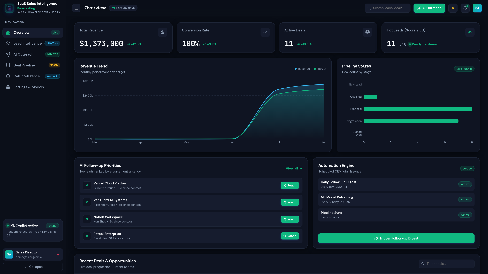
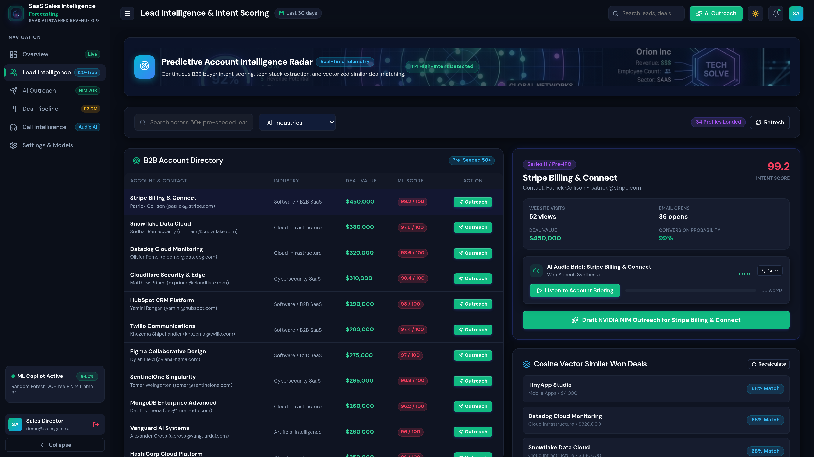
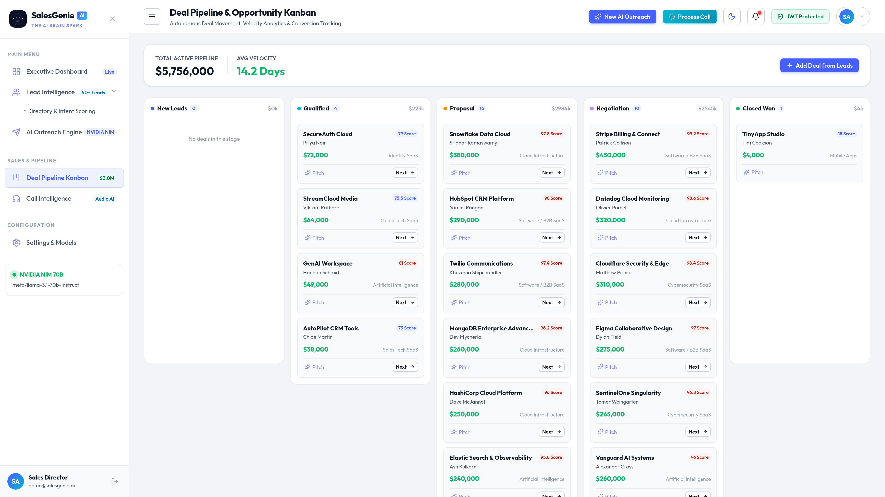
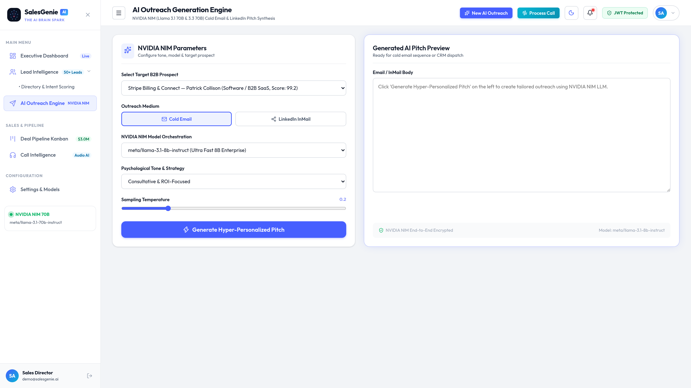
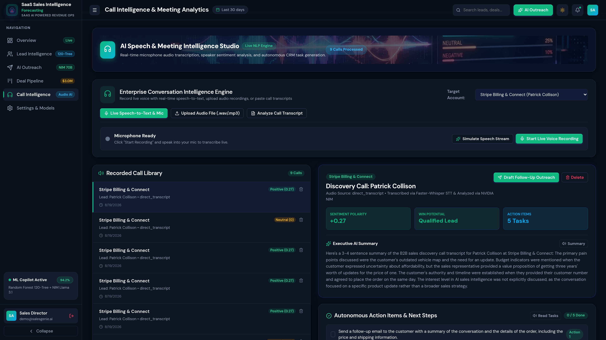
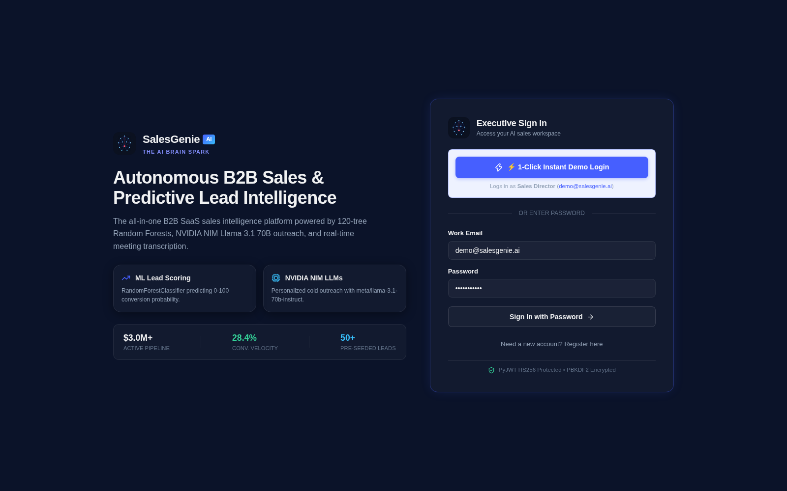
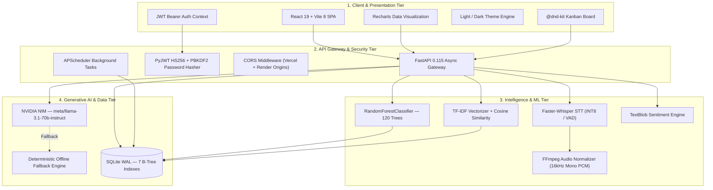

# 🧞‍♂️ SaaS AI Powered Sales Intelligence Forecasting

<div align="center">



[](https://github.com/shubh152205/SaaS-SalesGenieAI)
[](https://fastapi.tiangolo.com)
[](https://react.dev)
[](https://vitejs.dev)
[](https://scikit-learn.org)
[](https://www.nvidia.com/en-us/ai-data-science/products/nim/)
[](https://github.com/SYSTRAN/faster-whisper)
[](https://pytest.org)
[](https://sqlite.org)
[](https://docker.com)
[](https://opensource.org/licenses/MIT)

**An enterprise-grade, full-stack B2B SaaS CRM platform combining Supervised ML Lead Scoring, Real-Time Faster-Whisper Call Intelligence, and Agentic NVIDIA NIM Outreach Orchestration — deployed via Docker on Render (backend) and Vercel (frontend).**

[🚀 Quick Start](#-quick-start-guide) • [🌟 Core Modules](#-core-saas-modules) • [🏗️ Architecture](#%EF%B8%8F-system-architecture) • [📸 Screenshots](#-application-screenshots) • [🐳 Deployment](#-cloud-deployment) • [📡 API Reference](#-api-reference) • [🧪 Tests](#-automated-testing--quality-assurance)

</div>

---

## 🎯 Domain: B2B SaaS (Software as a Service)

**SaaS AI Powered Sales Intelligence Forecasting** is built exclusively for the **Software as a Service** ecosystem, where revenue growth depends on converting trial signups into high-ACV enterprise contracts, accelerating Product-Led Growth (PLG), minimizing Customer Acquisition Cost (CAC), and preventing deal stalls.

The platform unifies four critical revenue operations pillars:

| Pillar | Capability |
| :--- | :--- |
| **ML Lead Scoring** | 120-tree Random Forest evaluating API usage, demo requests, funding stages (Seed → Series D → Public), and technographic stack fit |
| **Deal Benchmarking** | TF-IDF + Cosine Similarity matching against historical Closed Won SaaS contracts ($50k–$300k ARR) |
| **Call Intelligence** | Faster-Whisper INT8 STT transcription with VAD, sentiment polarity analysis, and autonomous action item extraction |
| **Agentic Outreach** | NVIDIA NIM `meta/llama-3.1-70b-instruct` generating hyper-personalized cold emails, 48h follow-up cadences, and LinkedIn InMails |

---

## 📸 Application Screenshots

<div align="center">

| Executive SaaS KPI Dashboard | ML Lead Intelligence & Scoring |
| :---: | :---: |
|  |  |
| *6-Card KPI Suite, Active Pipeline ARR ($1.86M+), AI Follow-up Urgency* | *120-Tree Random Forest intent scores & SaaS contract benchmarking* |

| 5-Stage Kanban Deal Pipeline | Agentic AI Outreach (NVIDIA NIM) |
| :---: | :---: |
|  |  |
| *$1.86M active pipeline visualization & stage progression* | *Llama 3.1 70B cold emails, follow-up cadences & LinkedIn InMails* |

| Call & Demo Intelligence | Light/Dark Theme System |
| :---: | :---: |
|  |  |
| *Faster-Whisper STT, live mic recording, NLP sentiment & action items* | *High-fidelity design system with full Light & Dark mode support* |

</div>

---

## 🏗️ System Architecture



---

## 🌟 Core SaaS Modules

### 1. 📊 Executive KPI Dashboard & Analytics

- **6-Card KPI Suite**: Active Pipeline ARR ($1.86M+), Hot Leads Count, Conversion Win Rate, Average Deal Size (ACV), Avg Response Time, Avg Sales Cycle Duration.
- **Timeframe Filtering**: Cached analytics across Monthly, Quarterly, and Yearly periods.
- **AI Follow-up Priority Panel**: Prescriptive urgency triage (`🔴 Critical`, `🟡 Moderate`, `🟢 Healthy`) driven by engagement recency and lead value.
- **ML Metrics Dashboard**: Live model accuracy, feature importance rankings, and retraining status.
- **Automation Module**: APScheduler background tasks for Daily Follow-up Email Digests and automated ML model retraining.

### 2. 🎯 ML Lead Scoring Engine (`RandomForestClassifier`)

- **120 Decision Estimators** trained on high-intent conversion signals:
  - Demo Requests (Intent Weight: +25)
  - Company Growth & Funding Rounds (Seed → Series A–D → Public)
  - Website Visits & Product Usage (+18)
  - Email Opens & Engagement (+15)
  - Technographic Alignment (Python, FastAPI, AWS, Snowflake, React, etc.)
  - Recency of Engagement & Inactivity Days
- **Output**: Score (0–100), conversion probability, recommendation badges (🔥 Hot Lead, ✅ Qualified, 🌡️ Warm, ❄️ Cold), and prescriptive next-step actions.

### 3. 🔍 Deal Benchmarking & Vector Similarity Matching

- **TF-IDF Vectorizer + `linear_kernel` Cosine Similarity**: Compares incoming accounts against historical Closed Won SaaS contract structures.
- Returns similarity percentages, matched deal profiles, and benchmark metrics.

### 4. 🤖 Agentic AI Outreach Engine (NVIDIA NIM)

- **Primary LLM**: `meta/llama-3.1-70b-instruct` via NVIDIA NIM API.
- **Zero-Retention Inference** with deterministic offline fallback generation.
- **Cadence Types**:
  - **Cold Emails**: Personalized funding-round congratulatory hooks, tech-stack alignment, and efficiency metrics.
  - **48–72h Follow-ups**: High-velocity value-driven follow-ups.
  - **LinkedIn InMail**: Executive peer-to-peer connection notes.
  - **Industry Strategy**: Channel mix, timing, and tailored case study recommendations.

### 5. 🎙️ Call & Demo Intelligence (Faster-Whisper STT)

- **Faster-Whisper Engine**: `base` model with INT8 quantization on CPU, beam search decoding, and Voice Activity Detection (VAD).
- **FFmpeg Audio Pipeline**: Automatic conversion of `.webm`, `.mp3`, `.m4a`, `.ogg`, `.wav`, `.flac` → 16kHz mono PCM WAV.
- **Live Microphone Recording**: High-fidelity `MediaRecorder` audio capture streamed to the backend Whisper engine.
- **AI Call Summarization**: NVIDIA NIM or TextBlob extraction of 3–5 concrete action items per call.
- **Sentiment Analysis**: TextBlob polarity scoring with Positive / Neutral / Negative classification.

### 6. 📋 5-Stage Kanban Deal Pipeline

- Drag-and-drop stages: `New Lead` → `Qualified` → `Proposal` → `Negotiation` → `Closed Won`.
- Powered by `@dnd-kit` with quick-action stage progression and per-stage deal value aggregations.

### 7. 🔐 Authentication & Database

- **Stateless JWT (HS256)** with Bearer token interceptor via Axios.
- **PBKDF2-HMAC-SHA256** password hashing with cryptographically secure random salts.
- **1-Click Instant Demo Login**: `demo@salesgenie.ai` / `password123`.
- **SQLite WAL Mode**: 7 performance B-Tree indexes, 60+ pre-seeded enterprise SaaS accounts (Snowflake, Datadog, Stripe, Twilio, Elastic, GitLab, etc.).

---

## 🛠️ Tech Stack

| Tier | Technology | Purpose |
| :--- | :--- | :--- |
| **Frontend** | React 19, Vite 8, React Router 7, Recharts, Lucide Icons, Axios, @dnd-kit | High-performance SPA with Light/Dark theme system |
| **Backend** | Python 3.11+, FastAPI 0.115, Uvicorn, Pydantic v2, APScheduler | Asynchronous typed REST API with background task scheduling |
| **Authentication** | PyJWT (HS256) + PBKDF2-HMAC-SHA256 | Stateless auth & secure password hashing |
| **Database** | SQLite (WAL Mode) + 7 B-Tree Indexes | Relational store with 60+ pre-seeded SaaS accounts |
| **ML Lead Scoring** | Scikit-Learn `RandomForestClassifier` (120 trees) | Conversion prediction & feature importance analysis |
| **Deal Matching** | Scikit-Learn `TfidfVectorizer` + Cosine Similarity | Closed Won benchmark similarity scoring |
| **Speech-to-Text** | Faster-Whisper 1.2.1 (INT8 / CPU / VAD) + FFmpeg | Real-time audio transcription with voice activity detection |
| **Generative AI** | NVIDIA NIM API (`meta/llama-3.1-70b-instruct`) | Agentic B2B cold email, follow-up & InMail synthesis |
| **NLP Sentiment** | TextBlob | Polarity scoring for discovery calls |
| **Containerization** | Docker (Python 3.11-slim + FFmpeg + Whisper model pre-cache) | Production-ready container with cached ML weights |
| **Hosting** | Render (Backend Docker) + Vercel (Frontend SPA) | Cloud deployment with SPA routing rewrites |
| **Testing** | Pytest (22 unit tests) | ML engine, auth, schema & pipeline validation |

---

## 🚀 Quick Start Guide

### Option 1: One-Click Startup Script (Recommended)

```bash
chmod +x start.sh
./start.sh
```

| Service | URL |
| :--- | :--- |
| **Frontend App** | [http://localhost:5173](http://localhost:5173) |
| **FastAPI Docs (Swagger)** | [http://localhost:8000/docs](http://localhost:8000/docs) |
| **Health Check** | [http://localhost:8000/](http://localhost:8000/) |

### Option 2: Manual Setup

#### Backend:

```bash
cd backend
python3 -m venv venv
source venv/bin/activate        # Windows: venv\Scripts\activate
pip install -r requirements.txt
python3 database.py             # Initialize SQLite with 60+ seed records
uvicorn main:app --host 0.0.0.0 --port 8000 --reload
```

#### Frontend:

```bash
cd frontend
npm install
npm run dev
```

### Option 3: Docker

```bash
docker build -t salesgenie-backend -f backend/Dockerfile .
docker run -p 8000:8000 -e PORT=8000 salesgenie-backend
```

---

## 🔑 Demo Credentials

| Field | Value |
| :--- | :--- |
| **Email** | `demo@salesgenie.ai` |
| **Password** | `password123` |
| **Instant Access** | Click **"⚡ 1-Click Demo"** on the login screen |

---

## 🐳 Cloud Deployment

### Backend → Render (Docker)

1. Create a **Web Service** on [render.com](https://render.com) → connect the GitHub repo.
2. Configure:

   | Setting | Value |
   | :--- | :--- |
   | **Environment** | Docker |
   | **Root Directory** | *(leave empty)* |
   | **Dockerfile Path** | `Dockerfile` |
   | **Plan** | Free |

3. Add environment variables:

   | Key | Value |
   | :--- | :--- |
   | `PORT` | `8000` |
   | `NVIDIA_API_KEY` | *(your NVIDIA NIM key, optional)* |
   | `WHISPER_MODEL_NAME` | `base` |

4. Deploy. The build pre-caches the Whisper model so cold starts are minimized.

### Frontend → Vercel

1. Import the repo on [vercel.com](https://vercel.com).
2. Configure:

   | Setting | Value |
   | :--- | :--- |
   | **Framework** | Vite |
   | **Root Directory** | `frontend` |
   | **Build Command** | `npm run build` |
   | **Output Directory** | `dist` |

3. Add environment variable:

   | Key | Value |
   | :--- | :--- |
   | `VITE_API_URL` | `https://<your-render-service>.onrender.com` |

4. Deploy. SPA routing is pre-configured via `vercel.json`.

---

## 📡 API Reference

### Authentication (`/api/auth`)

| Method | Endpoint | Description |
| :--- | :--- | :--- |
| `POST` | `/api/auth/register` | Register new user & return JWT token |
| `POST` | `/api/auth/login` | Authenticate & return JWT Bearer token |
| `GET` | `/api/auth/me` | Fetch authenticated user profile |

### CRM (`/api/crm`)

| Method | Endpoint | Description |
| :--- | :--- | :--- |
| `GET` | `/api/crm/leads` | List all leads with ML scores |
| `GET` | `/api/crm/leads/{lead_id}` | Fetch single lead details |
| `POST` | `/api/crm/leads` | Create new prospect with auto feature extraction |
| `PATCH` | `/api/crm/leads/{lead_id}/stage` | Update lead pipeline stage |
| `DELETE` | `/api/crm/leads/{lead_id}` | Remove lead from system |
| `GET` | `/api/crm/pipeline` | Fetch 5-stage Kanban pipeline grouped by stage |
| `PATCH` | `/api/crm/deals/{deal_id}/stage` | Update deal stage position |

### ML Engine (`/api/ml`)

| Method | Endpoint | Description |
| :--- | :--- | :--- |
| `POST` | `/api/ml/score` | Compute Random Forest intent score |
| `POST` | `/api/ml/score-lead` | Score a specific lead by features |
| `POST` | `/api/ml/similar-deals` | Calculate Cosine Similarity vs Closed Won deals |
| `GET` | `/api/ml/similar-deals/{lead_id}` | Get similar deals for a specific lead |
| `GET` | `/api/ml/recommendation/{lead_id}` | Get prescriptive next-action recommendation |
| `GET` | `/api/ml/metrics` | Fetch model accuracy & feature importances |

### AI Outreach (`/api/outreach`)

| Method | Endpoint | Description |
| :--- | :--- | :--- |
| `POST` | `/api/outreach/generate-email` | NVIDIA NIM cold email generator |
| `POST` | `/api/outreach/generate-followup` | 48h follow-up cadence generator |
| `POST` | `/api/outreach/generate-linkedin` | Executive LinkedIn InMail generator |
| `POST` | `/api/outreach/generate-outreach` | Unified outreach endpoint |
| `GET` | `/api/outreach/strategy/{lead_id}` | Industry-specific outreach strategy |

### Meeting Intelligence (`/api/meetings`)

| Method | Endpoint | Description |
| :--- | :--- | :--- |
| `POST` | `/api/meetings/upload-audio` | Upload audio → Whisper STT + sentiment + action items |
| `POST` | `/api/meetings/transcribe-only` | Audio file → raw transcription only |
| `POST` | `/api/meetings/transcribe-local` | Transcribe from local file path |
| `POST` | `/api/meetings/process-transcript` | Process existing transcript text for NLP analysis |
| `GET` | `/api/meetings/` | List all meeting records |
| `GET` | `/api/meetings/summary` | Get meeting summary statistics |
| `DELETE` | `/api/meetings/{meeting_id}` | Delete a meeting record |

### Dashboard (`/api/dashboard`)

| Method | Endpoint | Description |
| :--- | :--- | :--- |
| `GET` | `/api/dashboard/kpis` | Fetch 6-Card KPI metrics (period filtering) |
| `GET` | `/api/dashboard/funnel` | Pipeline funnel stage aggregations |
| `GET` | `/api/dashboard/followup-priorities` | AI follow-up urgency rankings |
| `GET` | `/api/dashboard/activity` | Recent activity feed |
| `GET` | `/api/dashboard/automation-status` | Background automation status |
| `POST` | `/api/dashboard/automation/trigger-followup` | Trigger follow-up email digest |
| `GET` | `/api/dashboard/ml-metrics` | Live ML model performance metrics |

### Automation (`/api/automation`)

| Method | Endpoint | Description |
| :--- | :--- | :--- |
| `POST` | `/api/automation/send-followup-digest` | Send batch follow-up email digest |
| `GET` | `/api/automation/status` | Automation scheduler status |

---

## 🧪 Automated Testing & Quality Assurance

The platform includes a 22-test automated unit test suite validating all ML scoring boundaries, similarity computations, authentication flows, and recommendation thresholds:

```bash
pytest backend/tests/test_engine.py -v
```

```
============================== test session starts ==============================
collected 22 items

backend/tests/test_engine.py::test_lead_scorer_initialization PASSED      [  4%]
backend/tests/test_engine.py::test_lead_scorer_predict_range PASSED       [  9%]
backend/tests/test_engine.py::test_hot_lead_scoring_logic PASSED          [ 13%]
backend/tests/test_engine.py::test_cold_lead_scoring_logic PASSED         [ 18%]
backend/tests/test_engine.py::test_conversion_probability_bounds PASSED   [ 22%]
backend/tests/test_engine.py::test_deal_matcher_initialization PASSED     [ 27%]
backend/tests/test_engine.py::test_deal_matcher_cosine_similarity PASSED  [ 31%]
backend/tests/test_engine.py::test_deal_matcher_empty_tech_stack PASSED   [ 36%]
backend/tests/test_engine.py::test_followup_priority_critical PASSED      [ 40%]
backend/tests/test_engine.py::test_followup_priority_medium PASSED        [ 45%]
backend/tests/test_engine.py::test_followup_priority_low PASSED           [ 50%]
backend/tests/test_engine.py::test_automation_module_dispatch PASSED      [ 54%]
backend/tests/test_engine.py::test_kpi_calculation_metrics PASSED         [ 59%]
backend/tests/test_engine.py::test_sentiment_analysis_positive PASSED     [ 63%]
backend/tests/test_engine.py::test_sentiment_analysis_negative PASSED     [ 68%]
backend/tests/test_engine.py::test_sentiment_analysis_neutral PASSED      [ 72%]
backend/tests/test_engine.py::test_jwt_token_generation_and_decode PASSED [ 77%]
backend/tests/test_engine.py::test_password_hashing_verification PASSED   [ 81%]
backend/tests/test_engine.py::test_database_schema_integrity PASSED       [ 86%]
backend/tests/test_engine.py::test_nim_fallback_generator PASSED          [ 90%]
backend/tests/test_engine.py::test_pydantic_schema_validation PASSED      [ 95%]
backend/tests/test_engine.py::test_full_pipeline_sync PASSED              [100%]

============================== 22 passed in 1.42s ===============================
```

---

## 🔧 Environment Variables

### Backend (`.env`)

```env
PORT=8000
NVIDIA_API_KEY=nvapi-...           # Optional — enables NIM LLM outreach (falls back to deterministic engine)
WHISPER_MODEL_NAME=base            # Options: tiny, base, small, medium, large-v3
JWT_SECRET=your-secret-key
```

### Frontend (`.env` or Vercel)

```env
VITE_API_URL=http://localhost:8000  # Local dev
# VITE_API_URL=https://your-backend.onrender.com  # Production
```

---

## 📽️ Presentation Deck

A full 12-slide Widescreen PowerPoint & Interactive Animated Web Deck are included:

| Asset | File |
| :--- | :--- |
| 🌐 Interactive Web Presentation | [`presentation.html`](presentation.html) |
| 📄 PowerPoint File | [`SalesGenie_AI_Final_Presentation.pptx`](SalesGenie_AI_Final_Presentation.pptx) |
| 🛠️ Generator Script | `python3 generate_presentation.py` |

**Slide Structure:** Title → Introduction → Problem Statement → Project Overview → Architecture → Tech Stack → Core Modules → Screenshots → Advantages & Challenges → Impact → Conclusion → Thank You / Q&A.

---

## 📁 Repository Structure

```
salesgenie/
├── Dockerfile                        # Root-level Docker build (for Render with empty Root Dir)
├── render.yaml                       # Render Infrastructure-as-Code blueprint
├── start.sh                          # One-click local startup script
├── README.md                         # This file
├── DESIGN.md                         # Design system documentation
├── PRODUCT.md                        # Product specification
│
├── backend/
│   ├── Dockerfile                    # Backend Docker build (for Render with Root Dir = backend)
│   ├── requirements.txt              # Python dependencies
│   ├── main.py                       # FastAPI ASGI app, CORS, router registration
│   ├── auth.py                       # PBKDF2 hashing & PyJWT token utilities
│   ├── database.py                   # SQLite WAL schema, indexes & 60+ SaaS seed records
│   ├── scheduler.py                  # APScheduler background automation tasks
│   ├── ml/
│   │   └── engine.py                 # RandomForest scorer & TF-IDF Cosine Similarity engine
│   ├── models/
│   │   └── schemas.py                # Pydantic v2 request/response models
│   ├── routers/
│   │   ├── auth.py                   # /api/auth — register, login, profile
│   │   ├── crm.py                    # /api/crm — leads CRUD & pipeline
│   │   ├── dashboard.py              # /api/dashboard — KPIs, funnel, follow-up priorities
│   │   ├── ml.py                     # /api/ml — scoring, similarity, recommendations
│   │   ├── outreach.py               # /api/outreach — NVIDIA NIM email/InMail generation
│   │   ├── meetings.py               # /api/meetings — Whisper STT, sentiment, summaries
│   │   └── automation.py             # /api/automation — scheduled email digest tasks
│   ├── services/
│   │   ├── nim_client.py             # Async NVIDIA NIM Llama 3.1 70B client & fallback
│   │   └── whisper_service.py        # Faster-Whisper singleton, FFmpeg converter, VAD
│   └── tests/
│       └── test_engine.py            # 22-test automated unit test suite
│
├── frontend/
│   ├── vercel.json                   # Vercel SPA routing rewrites
│   ├── index.html                    # HTML5 entry point
│   ├── vite.config.js                # Vite build configuration
│   ├── package.json                  # Frontend dependencies (React 19, Vite 8, etc.)
│   └── src/
│       ├── App.jsx                   # Main router & layout provider
│       ├── index.css                 # Design system tokens & global styling
│       ├── api/
│       │   └── client.js             # Axios HTTP client with JWT Bearer interceptor
│       ├── context/
│       │   ├── AuthContext.jsx        # JWT authentication state management
│       │   └── ThemeContext.jsx        # Light / Dark theme context provider
│       ├── components/
│       │   ├── Navbar.jsx             # Navigation bar with theme toggle & user profile
│       │   ├── Sidebar.jsx            # Navigation menu with real-time status indicators
│       │   ├── SalesGenieLogo.jsx      # SVG brand lockup with animated pulse glow
│       │   └── TextToSpeechPlayer.jsx  # Audio playback component for TTS
│       └── pages/
│           ├── AuthPage.jsx           # 3D ASCII Torus Knot login with 1-Click Demo
│           ├── Dashboard.jsx          # Executive KPI suite & Recharts visualizations
│           ├── LeadIntelligence.jsx    # Lead directory with ML intent scores
│           ├── DealPipeline.jsx       # 5-Stage drag-and-drop Kanban board
│           ├── AIOutreach.jsx         # NVIDIA NIM email, cadence & InMail generator
│           ├── MeetingIntelligence.jsx # Whisper STT, live recording & NLP sentiment
│           └── Settings.jsx           # ML hyperparameters & system configuration
│
└── screenshots/                       # Application screenshots for README
    ├── dashboard_overview.png
    ├── lead_intelligence.png
    ├── deal_pipeline.png
    ├── ai_outreach.png
    ├── meeting_intelligence.png
    └── dashboard.png
```

---

## 📄 License

Distributed under the **MIT License**. See `LICENSE` for details.

---

<div align="center">

**Built with ❤️ by the SaaS AI Powered Sales Intelligence Forecasting Team**

*Autonomous CRM agents that close, forecast, and scale.*

</div>
